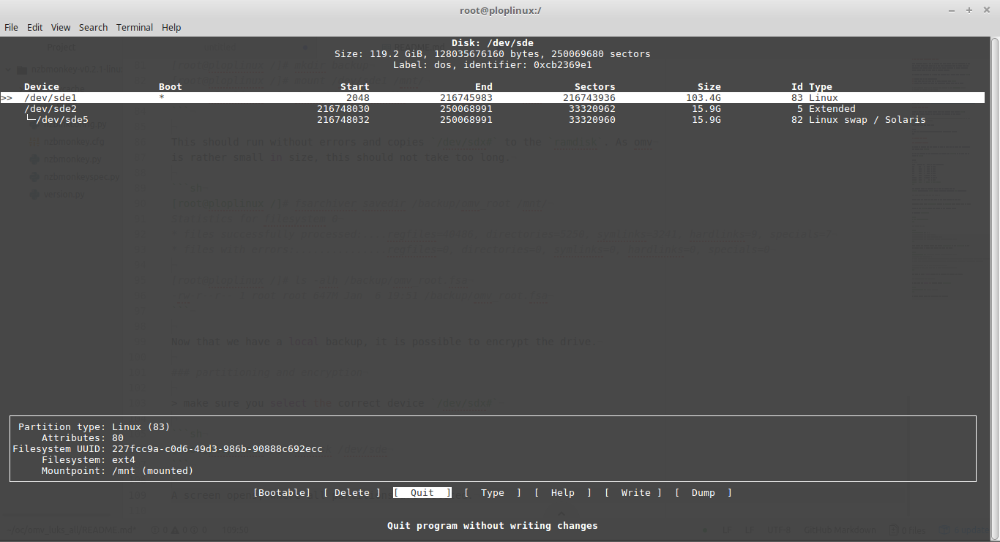
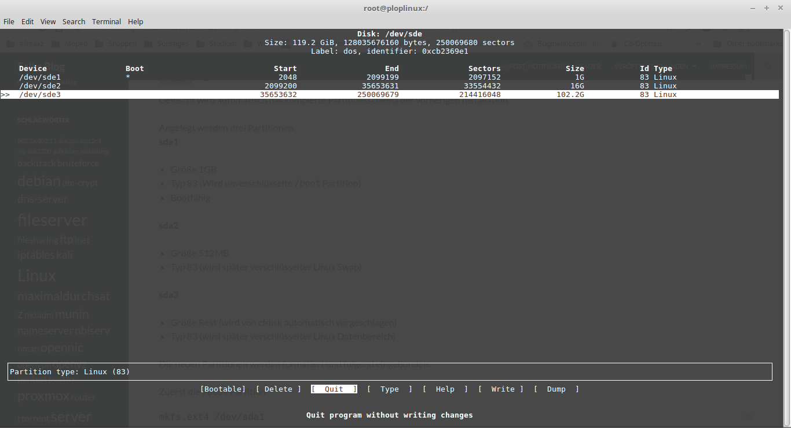
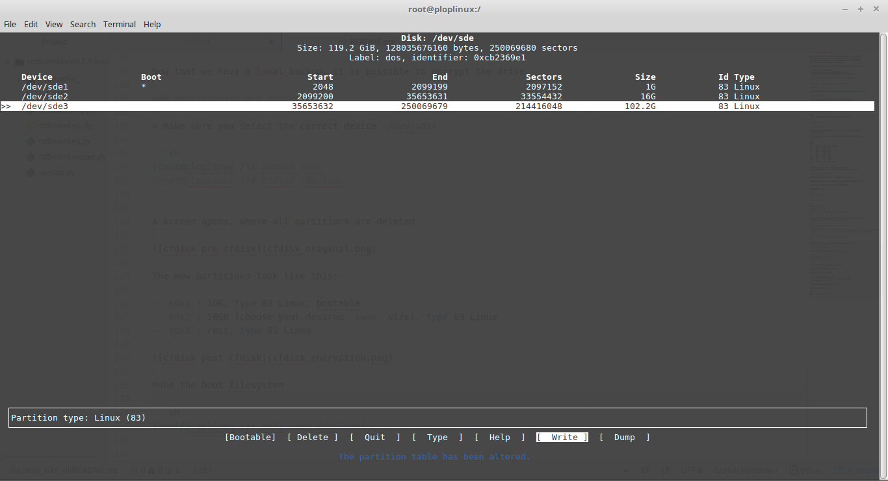

# OMV Full Disk Encryption with LUKS

This documents shows a way to encrypt all data (incl. OMV) and unlocking it via
ssh at boot time. This seems to be the only applicable way, as after boot and
encrypted data drives only, this has had major influence on system usability
(i.e. Docker mount on data lead to massive errors).

In general the approach is a fresh OMV install and a livecd with enabled `ssh`.

1. Install OMV as of documentation
2. Boot into live and make the OS drive enrypted with `luks`
3. Enrypt data drives and make the decryption derive from the OS drive

> This approach seems to be scalable and doable, as the `dropbear` unlock
> approach is limited to one drive.

> Create your usb stick with `dd` or apps like `unetbootin`

## OMV setup

### basic setup

Follow the documentation: https://wiki.openmediavault.org/index.php?title=Installation

- Set admin ui password
- if needed change admin ui port
- copy your pub key for user root (`ssh-copy-id root@<ip>`)
- disable ssh password login
- update to latest state (`apt update && apt dist-upgrade`)

### dropbear setup

Make sure following packages are present

```sh
apt install cryptsetup
apt install busybox dropbear
```

> please refer to `/usr/share/doc/dropbear-initramfs/README.initramfs` and
> `/usr/share/doc/cryptsetup/README.Debian.gz` Section 8

extend `/etc/initramfs-tools/initramfs.conf`

```sh
DEVICE=enp2s0
IP=$yourIP::$routerIP:255.255.255.0:$yourHostname:eth0:off
DROPBEAR=y
```

I am on a local lan and with port forwarding I do not want to expose dropbear to the
net. There I add `DROPBEAR_OPTIONS="-p 2222"` to `/etc/dropbear-initramfs/config`
to change the listening port to 2222.

Now paste your public ssh key to the `authorized_keys` file.

```sh
echo "ssh-rsa ..." >> /etc/dropbear-initramfs/authorized_keys
chmod 600 /etc/dropbear-initramfs/authorized_keys
```

Update the boot image

```sh
update-initramfs -u -k all
update-grub
```

> in case of perl language setting errors use `dpkg-reconfigure locales`

To later connect without host key error (you may of course use a specific ssh config)

```sh
ssh -o UserKnownHostsFile=/dev/null -o StrictHostKeyChecking=no -p2222 root@<ip>
```


## Live Boot USB Stick

Choose a live cd (or rescue system from your hoster) and enable `ssh`.
This makes things easier by copy pasting or chilling on the couch.

> I use (debian live)[https://cdimage.debian.org/debian-cd/current-live/amd64/iso-hybrid/]
> and enable `sshd` after boot manually (here)[http://www.zoyinc.com/?p=2510]

Create the live usb stick with

```sh
$ sudo dd if=./debian-live-9.3.0-amd64-lxde.iso of=/dev/sdb bs=4096
```

## Encrypt OMV drive

### Partition overview

In order to encrypt the omv drive, we need to save the OS drive and repartition
the device with `luks`.

To get an overview of the partitions to migrate use `lsblk`. In my case the OS
drive is `sde`.

```sh
# lsblk
NAME   MAJ:MIN RM   SIZE RO TYPE MOUNTPOINT
sda      8:0    0   3.7T  0 disk
sdb      8:16   0   3.7T  0 disk
sdc      8:32   0   3.7T  0 disk
sdd      8:48   0   3.7T  0 disk
sde      8:64   0 119.2G  0 disk
|-sde1   8:65   0 103.4G  0 part /
|-sde2   8:66   0     1K  0 part
`-sde5   8:69   0  15.9G  0 part [SWAP]
```

OMV creates those by default. We do want to change this to
`/boot` (unencrypted), `swap` (later encrypted randomly), `/` (encrypted).

### Boot into live USB and ssh into it

Select your usb stick at bios boot to use this instead of the hdd.
Enable `sshd`, if not enabled.

```sh
apt update && apt install openssh-server
sudo passwd root
sudo su - root
```

`/etc/ssh/sshd_config`
```sh
PermitRootLogin yes
PasswordAuthentication yes
```

```sh
service ssh restart
```

Login with `ssh`, create the backup of the mounted drive.

```sh
$ ssh root@192.168.x.x
```

### backup of omv


This should run without errors and copies `/dev/sdx#` to the `ramdisk`. As omv
is rather small in size, this should not take too long.

```sh
mkdir /oldroot
mount /dev/sde1 /mnt
rsync -a /mnt/ /oldroot/
umount /mnt
```

Now that we have a local backup, it is possible to encrypt the drive.

### partitioning and encryption

> make sure you select the correct device `/dev/sdx#`

```sh
cfdisk /dev/sde
```

A screen opens, where all partitions are deleted.



The new partitions look like this:

- `sdx1`: 1GB, type 83 Linux, bootable
- `sdx2`: 16GB (choose your desired `swap` size), type 83 Linux for later encryption
- `sdx3`: rest, type 83 Linux



Do not forget to write the changes



Check the partitions with `lsblk` and make the boot filesystem

```sh
mkfs.ext4 /dev/sde1
```

Now let's encrypt the root partition `sde3` and choosing a strong crypt key.

```sh
apt update && apt install cryptsetup
modprobe dm-crypt
cryptsetup --cipher aes-xts-plain64 -s 512 -h sha256 --iter-time 5000 luksFormat /dev/sde3
```

Verify it worked with

```sh
cryptsetup luksDump /dev/sde3
```

Lets open the drive and create a filesystem

```sh
cryptsetup luksOpen /dev/sde3 root
mke2fs -t ext4 /dev/mapper/root
```

### restore OMV

```sh
mkdir /newroot
mount /dev/mapper/root /newroot
mount /dev/sde1 /newroot/boot
rsync -a /oldroot/ /newroot/
```

Then bind folders needed to `chroot`

```sh
mount --bind /dev /newroot/dev
mount --bind /sys /newroot/sys
mount --bind /proc /newroot/proc
chroot /newroot
```

Next we will update everything

```sh
/etc/fstab:
UUID=<uuid of /dev/sde1> /boot ext4 defaults 0 1
/dev/mapper/root / ext4 defaults 0 2
# swap was on /dev/sde5 during installation
/dev/sde2 none            swap    sw              0       0
```

Use UUID to make sure the correct drive is mounted (`blkid /dev/sde3`)

```sh
/etc/crypttab:
# <target name>	<source device>		<key file>	<options>
root UUID=<uuid> none luks
```

RESUME is not wanted in initramfs

```sh
rm /etc/initramfs-tools/conf.d/resume
```

Update `/boot`

```sh
update-initramfs -u -k all
update-grub
grub-install /dev/sde
```

> `pre-up` lead to not working network with me. Just as a reminder...

To proper unload the dropbear network settings add the `pre-up` to the corresponding
$IFACE

```sh
/etc/network/interfaces:
iface enp2s0 inet static
    pre-up ip adr flush dev $IFACE
    ...
```

### live system reboot

umount every device after leaving the `chroot` and reboot

```sh
logout
umount /newroot/boot
umount /newroot/proc
umount /newroot/sys
umount /newroot/dev
umount /newroot
reboot
```

> make sure the livecd is not booted

## boot the system

log into the dropbear and run `cryptroot-unlock`

```sh
ssh -o UserKnownHostsFile=/dev/null -o StrictHostKeyChecking=no -p2222 root@x
Warning: Permanently added '[x]:2222' (ECDSA) to the list of known hosts.
To unlock root partition, and maybe others like swap, run `cryptroot-unlock`


BusyBox v1.22.1 (Debian 1:1.22.0-19+b3) built-in shell (ash)
Enter 'help' for a list of built-in commands.

~ # cryptroot-unlock
Please unlock disk root: <paste key>
cryptsetup: root set up successfully
```

Now you are able to login like normal and access OMV.
Next swap will be encrypted. Currently `free` should show 0 swap.

## encrypted swap

find the unique partition and use it as swap (UUID is always different, so not
usable)

```sh
find -L /dev/disk -samefile /dev/sde2
```

```sh
/etc/crypttab:
swap /dev/disk/by-id/ata-Samsung_SSD_840_PRO_Series_<...>-part2 /dev/urandom swap,cipher=aes-xts-plain64:sha256
```

```sh
/etc/fstab:
/dev/mapper/swap none swap sw 0 0
```

After a reboot `lsblk` output will be

```sh
NAME     MAJ:MIN RM   SIZE RO TYPE  MOUNTPOINT
sda        8:0    0   3,7T  0 disk  
sdb        8:16   0   3,7T  0 disk  
sdc        8:32   0   3,7T  0 disk  
sdd        8:48   0   3,7T  0 disk  
sde        8:64   0 119,2G  0 disk  
├─sde1     8:65   0     1G  0 part  /boot
├─sde2     8:66   0    16G  0 part  
│ └─swap 253:1    0    16G  0 crypt [SWAP]
└─sde3     8:67   0 102,2G  0 part  
  └─root 253:0    0 102,2G  0 crypt /
```

## encrypt data drives and derive keys from root

I setup for each data drive the same LUKS key and a second key that is derived
from root decrypt. This way at boot only one key is necessary but "in case"
the drives can be unlocked on their own.

Again, with `lsblk` show all drives.

### enrypt drives with backup key

Initial creation will be with an initial key, which is used to unlock in case
of emergency.

```sh
cryptsetup --cipher aes-xts-plain64 -s 512 -h sha256 --iter-time 5000 luksFormat /dev/sda
cryptsetup --cipher aes-xts-plain64 -s 512 -h sha256 --iter-time 5000 luksFormat /dev/sdb
cryptsetup --cipher aes-xts-plain64 -s 512 -h sha256 --iter-time 5000 luksFormat /dev/sdc
cryptsetup --cipher aes-xts-plain64 -s 512 -h sha256 --iter-time 5000 luksFormat /dev/sdd
```

### create derived keys and crypttab

Now lets add the key from the derived root mapper.

```sh
cryptsetup luksAddKey /dev/sda <(/lib/cryptsetup/scripts/decrypt_derived root)
cryptsetup luksAddKey /dev/sdb <(/lib/cryptsetup/scripts/decrypt_derived root)
cryptsetup luksAddKey /dev/sdc <(/lib/cryptsetup/scripts/decrypt_derived root)
cryptsetup luksAddKey /dev/sdd <(/lib/cryptsetup/scripts/decrypt_derived root)
```

`cryptsetup luksDump /dev/sda` now shows 2 keys.

To create the data_key on the enrypted root device

> This approach is chosen as i.e. `decrypt_derived` as `keyscript=` is ignored
> by `systemd`

```sh
mkdir -p /root/.luks
chmod 700 /root/.luks
/lib/cryptsetup/scripts/decrypt_derived root > /root/.luks/data_key
chmid 400 /root/.luks/data_key
```

Next append to `crypttab`, timeout is added to make it boot even in case of error.

```sh
/etc/crypttab:
# data drives
sda-crypt         UUID=xxxx          /root/.luks/data_key           luks,timeout=10s
sdb-crypt         UUID=xxxx          /root/.luks/data_key           luks,timeout=10s
sdc-crypt         UUID=xxxx          /root/.luks/data_key           luks,timeout=10s
sdd-crypt         UUID=xxxx          /root/.luks/data_key           luks,timeout=10s
```

Reboot and check if everything is mounted correctly

```sh
lsblk
NAME        MAJ:MIN RM   SIZE RO TYPE  MOUNTPOINT
sda           8:0    0   3,7T  0 disk  
└─sda-crypt 253:2    0   3,7T  0 crypt
sdb           8:16   0   3,7T  0 disk  
└─sdb-crypt 253:4    0   3,7T  0 crypt
sdc           8:32   0   3,7T  0 disk  
└─sdc-crypt 253:5    0   3,7T  0 crypt
sdd           8:48   0   3,7T  0 disk  
└─sdd-crypt 253:3    0   3,7T  0 crypt
sde           8:64   0 119,2G  0 disk  
├─sde1        8:65   0     1G  0 part  /boot
├─sde2        8:66   0    16G  0 part  
│ └─swap    253:1    0    16G  0 crypt [SWAP]
└─sde3        8:67   0 102,2G  0 part  
  └─root    253:0    0 102,2G  0 crypt /
```

From here you may start to use OMV as you like. If a drive is appended, use
the commands from above and add it to `/etc/crypttab`.

> OMV drive encryption plugin is usable as well to add the key and backup headers.

## create filesystem

Now whenever normaly refering to `/dev/sda` just use `/dev/mapper/sda-crypt` instead.

```sh
screen -d -m mkfs.ext4 -b 4096 -m 0 -E lazy_itable_init=0,lazy_journal_init=0 -O 64bit /dev/mapper/sda-crypt -L parity1
screen -d -m mkfs.ext4 -b 4096 -m 0 -E lazy_itable_init=0,lazy_journal_init=0 -O 64bit /dev/mapper/sdb-crypt -L data1
screen -d -m mkfs.ext4 -b 4096 -m 0 -E lazy_itable_init=0,lazy_journal_init=0 -O 64bit /dev/mapper/sdc-crypt -L data2
screen -d -m mkfs.ext4 -b 4096 -m 0 -E lazy_itable_init=0,lazy_journal_init=0 -O 64bit /dev/mapper/sdd-crypt -L data3
```
